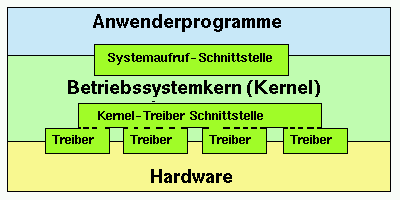

# Aufbau des Linux-Betriebssystems
Linux, erstellt nach dem Vorbild UNIX, ist ein modernes Multitasking- 
Multi-User-System.
- Multitasking bedeutet, dass ein mehrere Prozesse (Programme + Daten im Speicher) 
  gleichtzeitig ablaufen können
- Multiuser lässt mehrere Benutzer gleichzeitig am System arbeiten. Damit dies 
  möglich ist, muss es entweder mehrere Terminals am Rechner/Betriebssystem 
  geben (Client/Server-Architektur z.B.) oder man muss eine Möglichkeit bieten, 
  sich über das Netz einloggen zu können (z.B. openssh-server).
Probleme ergeben sich dann aber bei gleichzeitigem Zugriff auf eine Datei, 
Gerät, den Arbeitsspeicher, die Rechenleistung des Prozessors etc.
Dazu ist ein genügend ausgereiftes Betriebssytem notwendig!

## Systemarchitektur
Das zentrale "Bauteil" des Linux-Systems ist der Betriebssystem-Kern, auch 
Kernel genannt. Er trennt die Hardware von den Anwender-Programmen; nichts 
geschieht in diesen Programmen, ohne dass der Kernel davon weiss.
Die Interaktion mit der Hardware wird deshalb realisiert über sogenannte System 
Calls; die Anwenderprogramme rufen also den gewünschten System Call des 
Betriebssystems auf, der dann die tatsächliche Interaktion mit der Hardware 
vollführt.
Bsp: Programm will Text auf dem Bildschirm ausgeben -> System Call ans System -> 
System bringt den Text auf die Hardware (Bildschirm).
Damit das Betriebssystem weiss, wie es die Hardware anzusprechen hat, bedient es 
sich der Treiber für das jeweilige Gerät.

Ursprünglich war nun der Betriebssystemkern einer "monolithischen" Philosophie 
anhängig: Treiber und Funktionen wurden fest in den Kernel einkompiliert. Mit 
der Zeit hat sich das gewandelt und man benutzt eine hybride Strategie zwischen 
monolithischen und modularem Ker. Elementare Treiber sidn weiter fest im Kern 
vorhanden, während andere "bei Bedarf" geladen werden können.
Ein spezielles Anwenderprogramm ist bekanntlich die Shell, die das wesentlich 
funktionsdichtere Analog zu COMMAND.COM oder CMD.EXE auf Windows darstellt.
Die Shell (bash, fish, zsh etc.) stellt eine Eingabeaufforderung zur Verfügung, 
mit der sich weitere Programme und Funktionen in fortgeschrittener Weise 
verwenden lassen.